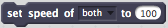
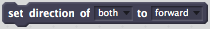
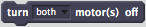
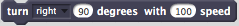
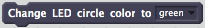
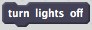
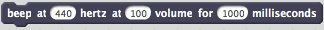
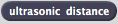

# Blocks

## Moves

### Go distance...

* __direction__: the direction of the movement
* __distance__: distance in centimeters
* __speed__: in percentage of the maximal speed the robot can move

### Set the speed...

* __motors__: which motor's speed should be adjusted
* __speed__: in percentage of the maximal speed the robot can move

### Set the direction...

* __motors__: which motor(s)'s speed should be adjusted
* __distance__: distance in centimeters

### Turn the motors on...

* __motors__: which motor(s) should be turned on

### Turn the motors off...

* __motors__: which motor(s) should be turned off

### Turn around...

* __direction__: the direction of the turn action
* __degrees__: the degree the robot should turn by
* __speed__: in percentage of the maximal speed the robot can turn

## Change the lightning...

### Change colours

This block will turn the lights on with the specified colour in parameter.

### Turn lights off

This block will turn the lights off.

## Play sound...

### Beep

* __frequency__: in hertz the robot should beep on
* __volume__: in percentage of the maximum volume the robot can emit
* __duration__: the length of the beep

## Sense the world around you...

### Ultrasonic distance

* __return__: the distance between the robot and the object in front of it

### Noise detector (_undocumented_)

### Light detector (_undocumented_)

